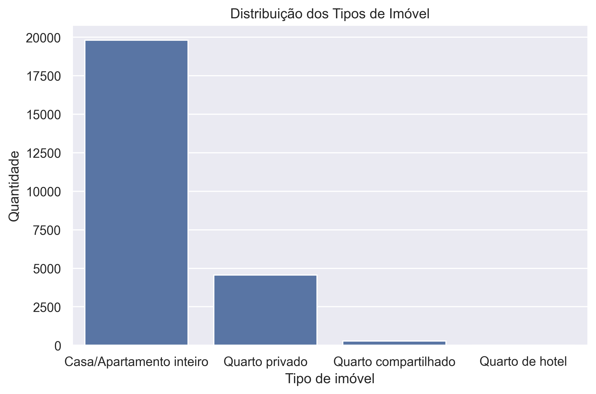
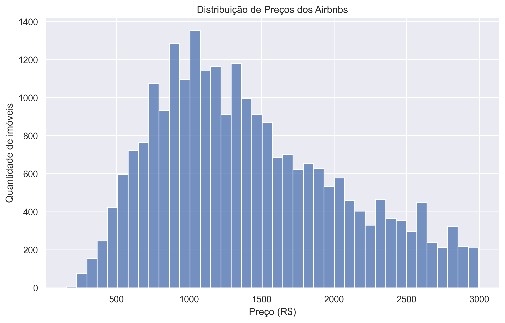
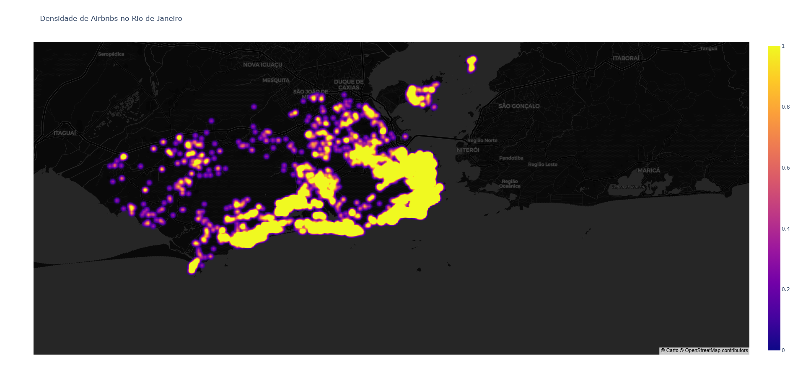
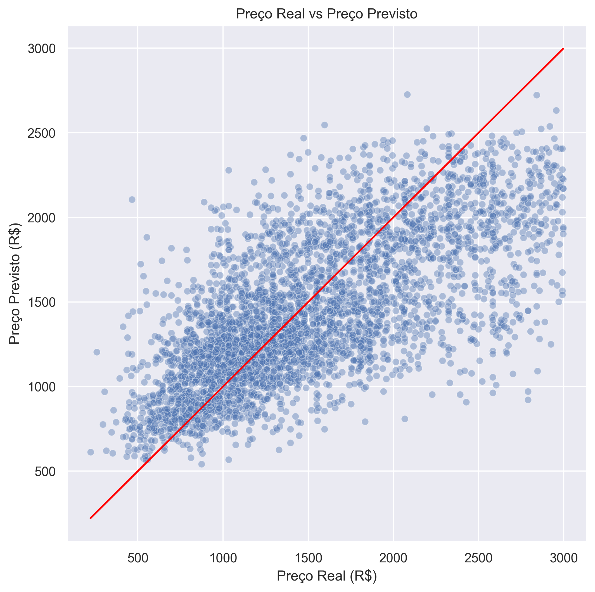
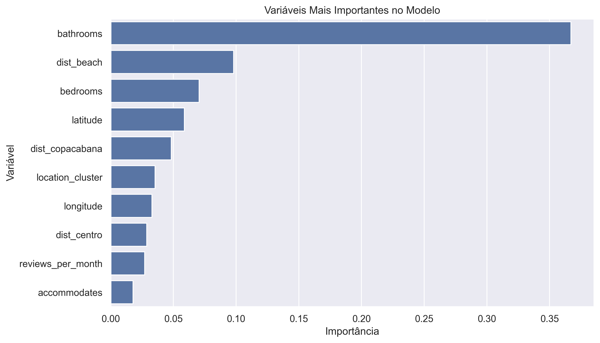

# 🏠 Airbnb Price Prediction — Rio de Janeiro

A complete Data Science and Machine Learning pipeline applied to the short-term rental real estate market in Rio de Janeiro.

This project analyzes Airbnb listing data and builds predictive models capable of estimating the optimal nightly price based on property characteristics and geographic location.

---

# 🔎 Project Overview

**Objective**

Predict the optimal nightly Airbnb price using property features and geospatial data.

**Dataset**

Inside Airbnb — Rio de Janeiro

**Approach**

Geospatial feature engineering + XGBoost regression model.

**Key Metric**

MAE: 341.69 BRL

---

# 🎯 Business Context

Setting the right price for short-term rentals is a complex optimization problem.

Prices that are too high reduce occupancy while prices that are too low reduce revenue.

A predictive pricing system helps hosts define competitive pricing strategies and helps analysts understand how location impacts property value.

---

# ⚙️ Data Pipeline

Raw Data → ETL → Feature Engineering → Model Training → Evaluation

---

# 🧹 Data Cleaning

- Removed currency symbols
- Converted prices to numeric
- Converted USD to BRL
- Removed missing values
- Removed extreme outliers with IQR filtering

---

# 🧠 Feature Engineering

Geospatial features were created using the Haversine distance to important locations such as beaches and city landmarks.

Latitude and longitude were also clustered using KMeans to identify spatial price patterns.

---

# 📊 Exploratory Data Analysis

## Room Type Distribution



## Price Distribution



## Geographic Price Map



---

# 🤖 Modeling Strategy

Instead of training a single model, the project trains separate models for:

- Entire homes/apartments
- Private rooms

This improves accuracy because different property types behave differently in the market.

---

# 🧮 Model

Model used: XGBoost Regressor

Chosen due to strong performance on tabular data and ability to capture nonlinear relationships.

---

# 📈 Model Performance

MAE: 341.69 BRL

RMSE: ~448 BRL

## Real vs Predicted



---

# 🔍 Feature Importance

Key features influencing predictions include:

- distance_to_beach
- latitude
- bathrooms
- bedrooms
- location_cluster



---

# 🧪 Example Prediction

Bedrooms: 2

Bathrooms: 1

Distance to Beach: 0.8 km

Location: Copacabana

Predicted price: ≈ R$425 per night

---

# 🗂 Project Structure

```
project
│
├── data
│   ├── raw
│   └── processed
│
├── src
│   ├── etl.py
│   ├── feature_engineering.py
│   ├── train_model.py
│
├── notebooks
│
├── main.py
│
└── requirements.txt
```

---

# 🛠 Tech Stack

Python

Libraries:

- pandas
- numpy
- scikit-learn
- xgboost
- matplotlib
- seaborn

---

# 🚀 Future Improvements

- SHAP explainability
- hyperparameter optimization
- deployment API
- interactive dashboard

---

# Conclusion

This project demonstrates how machine learning and geospatial feature engineering can be used to predict Airbnb prices and analyze real estate markets.

